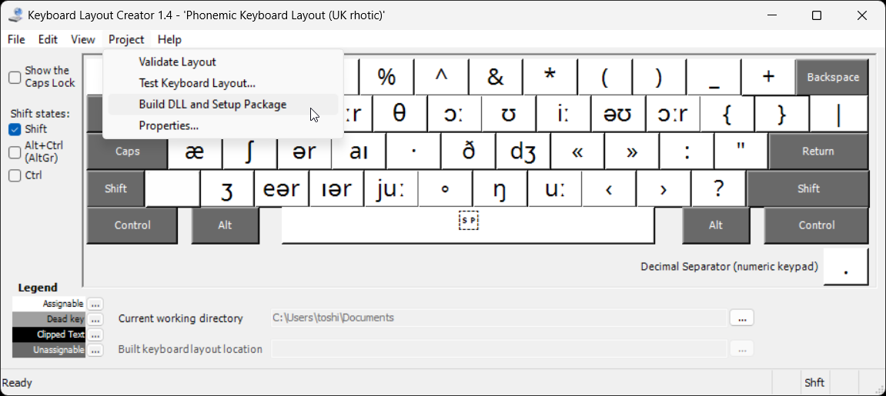

# Keyboard Layouts for Windows

This is one of the several related projects published on [NeilRaiden.github.io](https://github.com/NeilRaiden/NeilRaiden.github.io) ([NeilRaiden.com](https://neilraiden.com)):

 * [keyboard-layouts-Windows](https://github.com/NeilRaiden/keyboard-layouts-Windows) - _this project_
 * [keyboard-layouts-macOS](https://github.com/NeilRaiden/keyboard-layouts-macOS)
 * [keyboard-layouts-Linux](https://github.com/NeilRaiden/keyboard-layouts-Linux)

Each of the projects listed above contains the same keyboard layouts for the major operating systems (Windows, macOS and Linux):

 * **Writer** - aims to solve the problem of accessibility of various punctuation marks required by most writing style guides but not available on the standard QWERTY layout.
 * **ASERTH** - alternative to the famous **Colemak-DH**, based on [QWERTY-Flip-Twist](https://github.com/nick-gravgaard/qwerty-flip) designed by Nick Gravgaard, but enhanced with the punctuation marks required by writing style guides (like _Writer_). Designed for people already proficient with QWERTY (above 60wpm) who would like to retrain themselves to use more efficient layout. This layout offers easier/faster learning while achieving almost the same advantages as _Colemak_.
 * **ESL** - designed for ESL tutors (ESL = _English as a Second Language_) who may occasionally need to type English phonemes and phonetic marks used in English phonetic transcriptions.
 * **Shavian** or **ShawQWERTY** - the oldest layout for typing in English using Shaw Alphabet letters form the Unicode range U+10450--U+1047F (Shaw Alphabet is one of the best alternative writing system for English which is almost fully phonemic, and has shorthand features - single stroke per letter). Note that, this layout was the basis for all the _phonemic_ layouts mentioned above.
 * **ShawImperial** - based on [Imperial Good Companion Model 6 typewriter](https://oztypewriter.blogspot.com/2014/04/history-of-shavian-keyboard-imperial.html), the first typewriter machine designed for typing in Shaw Alphabet.
 * **Phonemic** layouts - designed for typing in English phonemically - for people trying to practice their _phonemic awareness_.
    - **US Phonemic**
    - **UK Phonemic**
    - **UK Rhotic** (the only difference between _UK rhotic_ and _UK phonemic_ is the use of ⟨r⟩ and ⟨ʳ⟩ in R-colored vowels, respectively)

### Differences between US and UK notations:

|  UK  | UK rhotic |  US  |
|:----:|:---------:|:----:|
|  ɑː  |    ɑː     |  ɑ   |
|  ɔː  |    ɔː     |  ɔ   |
|  uː  |    uː     |  u   |
|  iː  |    iː     |  i   |
|  ɑːʳ |    ɑːr    |  ɑr  |
|  ɔːʳ |    ɔːr    |  ɔr  |
|  ɜːʳ |    ɜːr    |  ɜr  |
|  əʊ  |    əʊ     |  ɔʊ  |
|  ʊəʳ |    ʊər    |  ʊr  |
|  eəʳ |    eər    |  er  |

-----

## Two formats 

The layouts for Windows are created in two formats:
 * `.ahk` - AutoHotKey version 2.0 scripts (Windows 10 and Windows 11)
 * `.klc` - to be compiled with **Microsoft Keyboard Layout Creator** (Windows 10)

-----

## AutoHotKey scripts

To use keyboard layouts in `.ahk` format, you need to:
1. Download and install AutoHotKey v2.0 from the [AutoHotKey website](https://www.autohotkey.com/download/ahk-v2.exe)
2. To start using the layout, simply double-click the file name of chosen keyboard layout downloaded from this repository.

----- 

## KLC files (Windows 10 only)

> Note: Windows 11 does not allow to install keyboard layouts compiled with **Microsoft Keyboard Layout Creator**. The only option is to use AutoHotkey scripts!

To compile `.klc` files on Windows 10:

1. Download **MSKLC v1.4** (Microsoft Keyboard Layout Creator version 1.4) from Microsoft website:
    - [Description & download](https://www.microsoft.com/en-us/download/details.aspx?id=102134)
    - [Direct link to binaries](https://download.microsoft.com/download/6/f/5/6f5ce43a-e892-4fd1-b9a6-1a0cbb64e6e2/MSKLC.exe>)
2. Install **MSKLC** on your PC
3. Open the `.klc` file with MSKLC - at this stage you can add your own modifications.
4. To build binaries: `Project › Build DLL and Setup Package`. By default the layout will be placed in the "My Documents" folder.
5. Installation: open the binaries folder, right-click `setup.exe`, select "Run as Administrator" to install.

-----

## On-Screen Keyboards

When learning a new keyboard layout it would be very helpful to use an On-Screen Keyboard.
However, in one of the Windows 10 updates Microsoft seems to have dropped support of Unicode in the `OSK.exe` on-screen keyboard.
Also, in Windows 10 and especially in Windows 11 the font fallback system is broken, so using any Unicode symbols that are not in the fonts provided by Microsoft may be impossible.

Microsoft Windows provides two On‑Screen Keyboards:

 * Old **OSK.exe** (`C:\Windows\System32\osk.exe`) — to start, press `WinKey+Ctrl+O`
 * New **TabTip.exe** (`C:\Program Files\Common Files\microsoft shared\ink\TabTip.exe`) - TabTip stands for **Tab**let **T**ext **I**nput **P**anel — part of the Inking feature (WinKey+I › Devices › Pen & Windows Ink). In Widows 10, to start tabtip.exe: right‑click system clock, select `Show touch keyboard button`. Click the keyboard button.

Please note: **osk.exe and tabtip.exe DO NOT support Unicode** — for example, instead of Shavian symbols the _ShawQWERTY_ layout shows blank rectangles.

The only layouts from this project that partially work with `OSK.exe` are the **Phonemic** layouts — but only show the *Unshifted* and *Shifted* layers.

Alternatives you may find on the Internet:

* [Free Virtual keyboard](https://freevirtualkeyboard.com/) — available as portable and as installer, but doesn't allow to change the font, so Shavian symbols are displayed as blocks.
* On-Screen Keyboard Portable from PortableApps.com — not really portable (installer). It is only a launcher for `OSK.exe` — Don't even bother.
* [Keyman](https://keyman.com/) — nice but takes over 200MB of space, occasionally switches layouts even when no key is pressed. Also, sends some data to unknown servers. Unpredictable and unstable behavior, possibly a keylogger, in summary: not recommended.

Since Windows is becoming icreasingly unusable, there is no point in developing anything new for Windows.
If you're stuck with Windows, use AutoHotkey scripts. If not, switch to Linux. 

-----

Copyright (c) 2025 Neil Raiden (AGPL v3)

